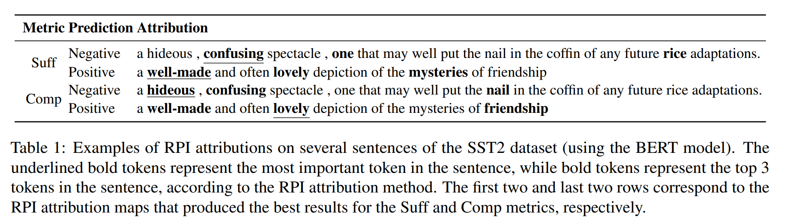

# PyTorch Implementation of RPI


## Introduction
This work presents Randomized Path-Integration (RPI) - a path-integration method for explaining language models via randomization of the integration path over the attention information in the model. 

### Visual illustration of the difference between baselines
<p align="center">
  
</p>

## Running RPI
Examples of running our method on BERT and LLAMA:
```
runs/run_bert.py
```
```
runs/run_llama.py
```

## Config
Config/tasks.py includes all the tasks configurations including dataset, model, test sizes.
When using dataset size None it means it uses the original dataset size.

For using Meta Llama model we downloaded the model and used it locally - meta-llama/Llama-2-7b-hf model.

