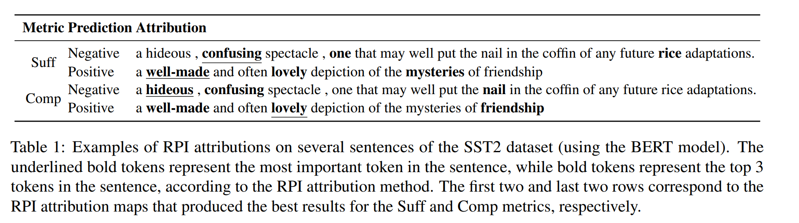

# PyTorch Implementation of RPI
## Introduction
Implementation of Randomized Path-Integration (RPI).


RPI is a path-integration method for explaining language models via randomization of the integration path over the attention information in
the model. The adaptability provided by multiple baselines enables RPI to select the most effective attribution map tailored to the specific evaluation metric


### Visual illustration of the difference between baselines
<p align="center">
  
</p>


## Running RPI
Examples of running our method on BERT and LLAMA:
```
runs/run_bert.py
```
```
runs/run_llama.py
```

## Config
Config/tasks.py includes the different datasets configs including the selected models.
When using dataset size None it means it uses the original dataset size.

For using Meta Llama model we downloaded the model and used it locally - meta-llama/Llama-2-7b-hf model.

